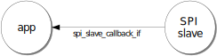
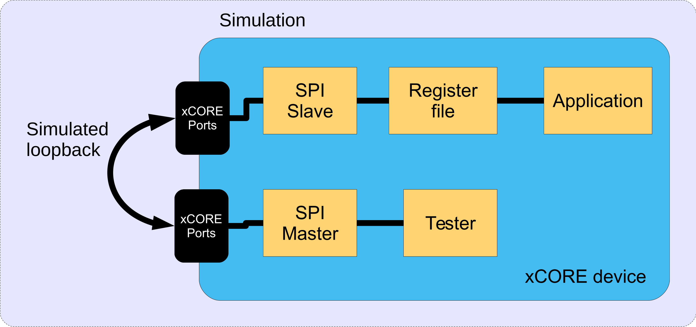
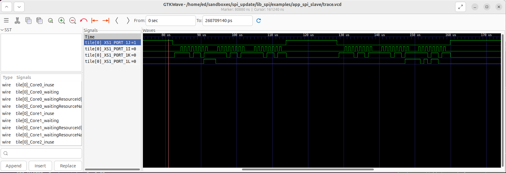

####################
lib_spi: SPI library
####################

************
Introduction
************

SPI is a four-wire hardware bi-directional serial interface. 
This library provides a software defined, industry-standard, SPI (serial peripheral
interface) component that allows you to control an SPI bus via the
xCORE GPIO ports.

The SPI bus can be used by multiple tasks within the xCORE device
and (each addressing the same or different slaves) and
is compatible with other slave devices on the same bus.

|newpage|

************************
Available SPI components
************************

Three components are provided in this library which offer different functionality.
They are all defined as a task with an interface which provides methods for transmitting
and receiving data. All components offer a `shutdown()` method allowing the component
to be exited at runtime which frees any resources used.

SPI Master (Synchronous)
========================

This component is the standard SPI master and is simplest to use. The `synchronous` aspect refers to the API and operation and
means that calls to this component block until the transaction has completed. The component
server may be placed on the same or a different tile from the client. If placed on the same
tile, the task may be `distributed` by the compiler which means it gets turned into a function
call and consequently does not consume an xCORE thread.

Multiple clients are supported and are arbitrated by the component. Multiple devices are also
supported by means of individual slave select bits within a port.

SPI Master (Asynchronous)
=========================

This component offers buffering functionality over the `synchronous` SPI master.
The `asynchronous` feature means that calls to this component can be non-blocking and SPI transfers
may be queued. The component server may be placed on the same or a different tile from the client.

Due to the buffering logic, the `asynchronous` version always consumes an xCORE thread.

Multiple clients are supported and are arbitrated by the component. Multiple devices are also
supported by means of individual slave select bits within a port.

SPI Slave
=========

The SPI slave component task always runs in its own xCORE thread because it needs to be 
responsive to the external master requests. It offers a single slave device with basic 
8 or 32 bit transfer support. 
It provides callbacks for when the slave needs data to transmit or has received data, as
well as a callback to indicate the end of a transaction.

|newpage|

*********
SPI Modes
*********

The data sample points for SPI are defined by the clock polarity (CPOL) and clock phase (CPHA)
parameters. SPI clock polarity may be inverted or non-inverted by the CPOL and the CPHA parameter
is used to shift the sampling phase. The following four sections illustrate the MISO and MOSI data lines
relative to the clock. The timings are given by:

.. list-table:: SPI timings
     :header-rows: 1
     :class: vertical-borders horizontal-borders

     * - Parameter
       - Description
     * - *t1*
       - The minimum time from the start of the transaction (SS asserted) to the first sample point/active clock edge. 
     * - *t2*
       - The minimum amount of time from the last sample point/active clock before SS is de-asserted.
     * - *t3*
       - The inter-transmission gap. This is the minimum amount of time that the slave select must be de-asserted between accesses on the same device. 
     * - *MAX CLOCK RATE*
       - This is the maximum clock rate supported by the configuration.

The setup and hold timings are inherited from the underlying xCORE
device. For details on these timing please refer to the device datasheet.

When operating above 20 Mbps please also see the :ref:`MISO port timing<miso_port_timing>` section.

Mode 0 - CPOL: 0 CPHA 0
=======================

.. wavedrom:: ../images/wavedrom_mode0.js
   :caption: Mode 0
   :width: 100%
   :align: center

The master and slave will drive out their first data bit before the first rising edge of the clock then drive on subsequent falling edges. They will sample on rising edges.

Mode 1 - CPOL: 0 CPHA 1
=======================

.. wavedrom:: ../images/wavedrom_mode1.js
   :caption: Mode 1
   :width: 100%
   :align: center
   

The master and slave will drive out their first data bit on the first rising edge of the clock and sample on the subsequent falling edge.

Mode 2 - CPOL: 1 CPHA 0
=======================

.. wavedrom:: ../images/wavedrom_mode2.js
   :caption: Mode 2
   :width: 100%
   :align: center

The master and slave will drive out their first data bit before the first falling edge of the clock then drive on subsequent rising edges. They will sample on falling edges.

Mode 3 - CPOL: 1 CPHA 1
=======================

.. wavedrom:: ../images/wavedrom_mode3.js
   :caption: Mode 3
   :width: 100%
   :align: center

The master and slave will drive out their first data bit on the first falling edge of the clock and sample on the subsequent rising edge.

|newpage|

***************************
External signal description
***************************

The SPI protocol requires a clock, one or more slave selects
and either one or two data wires.

.. _spi_wire_table:

.. list-table:: SPI data wires
     :header-rows: 1
     :class: vertical-borders horizontal-borders

     * - Signal
       - Description
     * - *SCLK*
       - Clock line, driven by the master
     * - *MOSI*
       - Master Output, Slave Input data line, driven by the master
     * - *MISO*
       - Master Input, Slave Output data line, driven by the slave
     * - *SS*
       - Slave select line, driven by the master

During any transfer of data, the master will assert the *SS*
line and then output a series of transitions on the *SCLK*
wire. During this time, the slave will drive data to be sampled by the
master and the master will drive data to be sampled by the slave. At
the end of the transfer, the *SS* is de-asserted.

If the slave select line is not driven high then the slave should
ignore any transitions on the other lines.

|newpage|

**********************************
Connecting to the xCORE SPI master
**********************************

The SPI wires need to be connected to the xCORE device as shown in
:numref:`spi_master_xcore_connect`. The signals can be connected to any
one bit ports, with the exception of slave select which may be any width 
port. All ports must be on the same tile.

.. _spi_master_xcore_connect:

.. figure:: ../images/spi_master_connect.*
   :width: 40%

   SPI master connection to the xCORE device

If only one data direction is required then the *MOSI* or *MISO* line
need not be connected. However, **asynchronous mode is only supported
if the MISO line is connected**.

The master component of this library supports multiple slaves on unique
slave select wires. The bit of the port used for each device is configurable
and so multiple slaves may share the same select bit if needed.

Disabling master data lines
===========================

The *MOSI* and *MISO* parameters of the ``spi_master()`` task are
optional. So in the top-level ``par`` statement the function can be
called with ``null`` instead of a port e.g.

.. code-block:: C

   spi_master(i_spi, 1, p_sclk, null, p_miso , p_ss, 1, clk_spi);

Similarly, the *MOSI* parameter of the ``spi_master_async()`` task is
optional (but the *MISO* port must be provided).

|newpage|

*********************************
Connecting to the xCORE SPI slave
*********************************

The SPI wires need to be connected to the xCORE device as shown in
:numref:`spi_slave_xcore_connect`. The signals can be connected to any
one bit ports on the device.

.. _spi_slave_xcore_connect:

.. figure:: ../images/spi_slave_connect.*
   :width: 40%

   SPI slave connection to the xCORE device

The slave will only send and receive data when the slave select is
driven high. Additionally the *MISO* line is set to high impedance
when not in use.

If the *MISO* line is not required then it need not be connected. The
*MOSI* line must always be connected.

Disabling slave data lines
==========================

The ``spi_slave()`` task has an optional *MISO* parameter (but the
*MOSI* port must be supplied).

|newpage|

************
Master Usage
************

SPI master synchronous operation
================================

There are two types of interface for SPI master components:
synchronous and asynchronous.

The synchronous API provides blocking operation. Whenever a client makes a
read or write call the operation will complete before the client can
move on - this will occupy the core that the client code is running on
until the end of the operation. This method is easy to use, has low
resource use and is very suitable for applications such as setup and
configuration of attached peripherals.

SPI master components are instantiated as parallel tasks that run in a
``par`` statement. For synchronous operation, the application can
connect via an interface connection using the ``spi_master_if`` interface type:

.. figure:: ../images/spi_master_task_diag.*

   SPI master task diagram

For example, the following code instantiates an SPI master component
and connect to it.

.. code-block:: C

   out buffered port:32 p_miso    = XS1_PORT_1A;
   out port p_ss                  = XS1_PORT_1B;
   out buffered port:22 p_sclk    = XS1_PORT_1C;
   out buffered port:32 p_mosi    = XS1_PORT_1D;
   clock clk_spi                  = XS1_CLKBLK_1;

   int main(void) {
     spi_master_if i_spi[1];
     par {
       spi_master(i_spi, 1, p_sclk, p_mosi, p_miso , p_ss, 1, clk_spi);
       my_application(i_spi[0]);
     }
     return 0;
   }

.. note:: The connection is an array of interfaces, so several tasks
          can connect to the same component instance. The slave select ports are
          also an array since the same SPI data lines can connect to several
          devices via different slave lines.

The final parameter of the ``spi_master()`` task is an optional clock
block. If the clock block is supplied then the maximum transfer rate
of the SPI bus is increased (see :numref:`spi_master_sync_timings`). If
``null`` is supplied instead then the performance is lower but no clock
block is used.

The application can use the client end of the interface connection to
perform SPI bus operations e.g.

.. code-block:: C

   void my_application(client spi_master_if spi) {
     uint8_t val;
     printf("Doing one byte transfer. Sending 0x22.\n");
     spi.begin_transaction(0, 100, SPI_MODE_0);
     val = spi.transfer8(0x22);
     spi.end_transaction(1000);
     printf("Read data %d from the bus.\n", val);
   }

Here, ``begin_transaction`` selects the device ``0`` and asserts its
slave select line. The application can then transfer data to and from
the slave device and finish with ``end_transaction``, which de-asserts
the slave select line.

Operations such as ``spi.transfer8`` will
block until the operation is completed on the bus.
More information on interfaces and tasks can be be found in
the `XMOS Programming Guide <https://www.xmos.com/documentation/XM-014363-PC/html/prog-guide/index.html>`_. By default the
SPI synchronous master mode component does not use any xCORE threads of its
own. It is a *distributed* task which means it will perform its
function on the xCORE thread of the application task connected to
it (provided the application task is on the same tile).

Synchronous master usage state machine
......................................

The function calls made on the SPI master interface must follow the
sequence shown by the state machine in :numref:`spi_master_usage_state_machine`.
If this sequence is not followed then the behaviour is undefined.

.. _spi_master_usage_state_machine:

.. uml::
   :width: 60%
   :caption: SPI master use state machine (synchronous)

   @startuml
   title SPI master use state machine (synchronous)

   [*] --> begin_transaction

   begin_transaction --> transfer8
   begin_transaction --> transfer32
   transfer8 --> transfer8
   transfer8 --> transfer32
   transfer8 --> end_transaction
   transfer32 --> transfer8
   transfer32 --> transfer32
   transfer32 --> end_transaction
   end_transaction --> begin_transaction
   begin_transaction --> end_transaction

   begin_transaction --> [*] : shutdown
   transfer8 --> [*] : shutdown
   transfer32 --> [*] : shutdown
   end_transaction --> [*] : shutdown

   @enduml

|newpage|

SPI master asynchronous operation
=================================

The synchronous API will block your application until the bus
operation is complete. In cases where the application cannot afford to
wait for this long, the asynchronous API can be used.

The asynchronous API offloads operations to another task. Calls are
provided to initiate reads and writes and notifications are provided
when the operation completes. This API requires more management in the
application but can provide much more efficient operation.

It is particularly suitable for applications where the SPI bus is
being used for continuous data transfer.

Setting up an asynchronous SPI master component is done in the same
manner as the synchronous component.

.. code-block:: C

   out buffered port:32 p_miso    = XS1_PORT_1A;
   out port p_ss                  = XS1_PORT_1B;
   out buffered port:22 p_sclk    = XS1_PORT_1C;
   out buffered port:32 p_mosi    = XS1_PORT_1D;

   clock cb      = XS1_CLKBLK_1;

   int main(void) {
     spi_master_async_if i_spi[1];
     par {
       spi_master_async(i_spi, 1, p_sclk, p_mosi, p_miso, p_ss, 1, cb);
       my_application(i_spi[0]);
     }
     return 0;
   }

|newpage|

The application can use the asynchronous API to offload bus
operations to the component. This is done by moving pointers to the
SPI slave task to transfer and then retrieving pointers when the
operation is complete. For example, the following code
repeatedly calculates 100 bytes to send over the bus and handles 100
bytes coming back from the slave.

.. code-block:: C

   void my_application(client spi_master_async_if spi) {
     uint8_t outdata[100];
     uint8_t indata[100];
     uint8_t * movable buf_in = indata;
     uint8_t * movable buf_out = outdata;

     // create and send initial data
     fill_buffer_with_data(outdata);
     spi.begin_transaction(0, 1000, SPI_MODE_0);
     spi.init_transfer_array_8(move(buf_in), move(buf_out), 100);
     while (1) {
       select {
         case spi.transfer_complete():
           spi.retrieve_transfer_buffers_8(buf_in, buf_out);
           spi.end_transaction();

           // Handle the data that has come in
           handle_incoming_data(buf_in);
           // Calculate the next set of data to go
           fill_buffer_with_data(buf_out);

           spi.begin_transaction(0, 100, SPI_MODE_0);
           spi.init_transfer_array_8(move(buf_in), move(buf_out));
           break;
       }
     }
   }

The SPI asynchronous task is combinable so can be run on a logical
core with other tasks (including the application task it is connected to).

|newpage|

Asynchronous master command buffering
.....................................

In order to provide asynchronous behaviour for multiple clients the asynchronous master
will store up to one ``begin_transaction`` and one ``init_transfer_array_8`` or
``init_transfer_array_32`` from each client. This means that if the
master is busy doing a transfer for client *X*, then client *Y* will
still be able to begin a transaction and send data fully
asynchronously. Consequently, after client *Y* has issued
``init_transfer_array_8`` or ``init_transfer_array_32`` it will be
able to continue operation whilst waiting for the notification.

Asynchronous master usage state machine
.......................................

The function calls made on the SPI master asynchronous interface must follow the
sequence shown by the state machine in :numref:`spi_master_usage_state_machine_async`.
If this sequence is not followed then the behaviour is undefined.

.. _spi_master_usage_state_machine_async:

.. uml::
   :caption: SPI master use state machine (asynchronous)
   :width: 60%

   @startuml
   title SPI master use state machine (asynchronous)

   [*] --> begin_transaction
   begin_transaction --> init_transfer_array_8
   begin_transaction --> init_transfer_array_32
   init_transfer_array_8 --> transfer_complete
   init_transfer_array_32 --> transfer_complete
   transfer_complete --> retrieve_transfer_buffers_8
   transfer_complete --> retrieve_transfer_buffers_32
   retrieve_transfer_buffers_8 --> retrieve_transfer_buffers_8
   retrieve_transfer_buffers_8 --> retrieve_transfer_buffers_32
   retrieve_transfer_buffers_8 --> end_transaction
   retrieve_transfer_buffers_32 --> retrieve_transfer_buffers_8
   retrieve_transfer_buffers_32 --> retrieve_transfer_buffers_32
   retrieve_transfer_buffers_32 --> end_transaction
   end_transaction --> begin_transaction
   begin_transaction --> end_transaction
   end_transaction --> [*] : shutdown

   @enduml

   

Master inter-transaction gap
============================

For both synchronous and asynchronous modes the ``end_transaction`` requires a
slave select de-assert time. This parameter will provide a minimum de-assert time between
two transaction on the same slave select. In the case where a ``begin_transaction``
asserting the slave select would violate the previous ``end_transaction`` then the
``begin_transaction`` will block until the slave select de-assert time has been
satisfied.

|newpage|

***********
Slave usage
***********

SPI slave components are instantiated as parallel tasks that run in a
``par`` statement. The application can connect via an interface
connection.

  SPI slave task diagram

For example, the following code instantiates an SPI slave component
and connect to it.

.. code-block:: C

   out buffered port:32    p_miso = XS1_PORT_1E;
   in port                 p_ss   = XS1_PORT_1F;
   in port                 p_sclk = XS1_PORT_1G;
   in buffered port:32     p_mosi = XS1_PORT_1H;
   clock                   cb     = XS1_CLKBLK_1;

   int main(void) {
     interface spi_slave_callback_if i_spi;
     par {
       spi_slave(i_spi, p_sclk, p_mosi, p_miso, p_ss, cb, SPI_MODE_0,
                 SPI_TRANSFER_SIZE_8);
       my_application(i_spi);
     }
     return 0;
   }

When a slave component is instantiated the mode and transfer size
needs to be specified. If you wish to change mode or width, you can
shutdown the component and re-start it.

|newpage|

The slave component acts as the client of the interface
connection. This means it can "callback" to the application to respond
to requests from the bus master. For example, the following code
snippet shows part of an application that responds to SPI transactions
where the first word is a command to read or write command and
subsequent transfers either provide or consume data.

.. code-block:: C

   while (1) {
     uint32_t command = 0;
     size_t index = 0;
     select {
       case spi.master_requires_data() -> uint32_t data:
          if (command == 0) {
            // Not got the command yet. This will be the
            // first word of the transaction.
            data = 0;
          } else if (command == READ_COMMAND) {
            data = get_read_data_item(index);
            index++;
          } else {
            data = 0;
          }
          break;
       case spi.master_supplied_data(uint32_t data, uint32_t valid_bits):
          if (command == 0) {
            command = data;
          } else if (command == WRITE_COMMAND) {
            handle_write_data_item(data, index);
            index++;
          }
          break;
       case spi.master_ends_transaction():
          // The master has de-asserted slave select.
          command = 0;
          index = 0;
          break;
      }
   }

.. note::

    The time taken to handle the callbacks will determine the
    timing requirements of the SPI slave and so should be kept as short as possible.
    See application note AN00161 for more details on different ways of working with the SPI slave component.

|newpage|

*********************************
SPI master timing characteristics
*********************************

Synchronous SPI master clock speeds
===================================

The maximum speed that the SPI bus can be driven depends on whether a
clock block is used, the speed of the xCORE thread that the SPI code
is running on and where both the *MISO* and *MOSI* lines are used. The
timings can be seen in :numref:`spi_master_sync_timings`.

.. _spi_master_sync_timings:

.. list-table:: SPI master timings (synchronous)
 :header-rows: 1

 * - Clock blocks
   - MOSI enabled
   - MISO enabled
   - Max kbps (62.5 MHz core)
   - Max kbps (100 MHz core)
 * - 0
   - 1
   - 0
   - 2500
   - 3500
 * - 0
   - 1
   - 1
   - 1200
   - 1300
 * - 1
   - 1
   - 0
   - 62500
   - 75000
 * - 1
   - 1
   - 1
   - 62500
   - 75000

Asynchronous SPI master clock speeds
====================================

The asynchronous SPI master uses the same transport layer as the SPI master using a clock block
and so achieves similar performance.

.. list-table:: SPI master timings (asynchronous)
 :header-rows: 1

 * - Clock blocks
   - MISO enabled
   - MOSI enabled
   - Max kbps (62.5 MHz core)
   - Max kbps (100 MHz core)
 * - 1
   - x
   - x
   - 62500
   - 75000

.. _miso_port_timing:

MISO port timing
================

Port timing is affected by chip pad and PCB delays. For the clock, slave-select and MOSI signals, all of the delays will be broadly matched.
This means port timing adjustment is normally not required even up to the fastest supported SPI clock rates.

For the MISO signal, there will be a 'round trip delay' starting with the clock edge output and finishing at the xCORE's input port.
The presence of this delay will mean the xCORE may sample too early since data signal will arrive later. 
It may be necessary to delay the sampling of the MISO pin to capture within the required window, particularly if the SPI clock is above 20 MHz.

Control over the signal capture is provided for all SPI master implementations that require a clock block. Please see the :ref:`API section<api_section>` `spi_master_sync_timings()` method which exposes the controls available for optimising setup and hold capture.

For details on how to calculate and adjust round-trip port timing, please consult the `IO timings for xcore.ai <https://www.xmos.com/documentation/XM-014231-AN/html/rst/index.html>`_ or `IO timings for xCORE200 <https://www.xmos.com/file/io-timings-for-xcore200>`_ document.

|newpage|

********************************
SPI slave timing characteristics
********************************

The xCORE thread running the SPI slave task will wait for the slave
select line to assert and then begin processing the transaction. At
this point it will call the ``master_requires_data`` callback to
application code. The time taken for the application to perform this
call will affect how long the xCORE thread has to resume processing
SPI data. This will affect the minimum allowable time between slave
select changing and data transfer from the master (*t1*).

The user of the library will need to determine this time based on their application.

After slave select is de-asserted the SPI slave task will call the
``master_ends_transaction`` callback. The time the application takes
to process this will affect the minimum allowable inter-transmission
gap between transactions (*t2*).  The user of the library will also need to
determine this time based on their application.

If the SPI slave task is combined will other tasks running on the same
xCORE thread then the other task may process an event delaying the
time it takes for the SPI slave task to react to events. This will add
these delays to the minimum times for both *t1* and *t2*. The library
user will need to take these into account in determining the timing
restrictions on the master.

.. note::

    The time taken to handle the callbacks will determine the
    timing requirements of the SPI slave, and so must be kept as short as possible.

Throughput for SPI slave versus mode and MOSI usage is shown in the following table.

.. list-table:: SPI slave timings
 :header-rows: 1

 * - SPI Mode
   - MOSI enabled
   - Max kbps (62.5 MHz core)
   - Max kbps (100 MHz core)
 * - 0
   - 0
   - 40000
   - 62500
 * - 1
   - 0
   - 40000
   - 62500
 * - 2
   - 0
   - 40000
   - 62500
 * - 3
   - 0
   - 40000
   - 62500
 * - 0
   - 1
   - 7000
   - 10000
 * - 1
   - 1
   - 7000
   - 10000
 * - 2
   - 1
   - 7000
   - 10000
 * - 3
   - 1
   - 7000
   - 10000

|newpage|

********
Examples
********

SPI Master Example
==================

Overview
........

The example uses the XMOS SPI library to perform some bus transactions as SPI master. The SPI master examples are run on the `xcore.ai` evaluation kit, `XK-EVK-XU316 <https://www.xmos.com/xk-evk-xu316>`_ using the WFM200 WiFi device as a simple SPI slave.

The application consists of two tasks:

   - A task that drives the SPI bus

   - An application task that connects to the SPI task

These tasks communicate via the use of xC interfaces. Note that for the SPI `synchronous` cases, even though
the SPI master and app are separate tasks, the compiler is able to `distribute` the SPI master so that the 
application only uses a single hardware thread.

:numref:`spi_master_example` shows the task and communication structure of the application.

.. _spi_master_example:

.. uml::
   :width: 60%
   :caption: Task diagram of SPI master example

   @startuml
   left to right direction
   circle app
   circle SPI_master
   app --> SPI_master : spi_master_if\nor\nspi_master_async_if
   @enduml

Declaring ports
...............

The SPI library connects to external pins via xCORE ports. In
``main.xc`` these are declared as variables of type ``port`` at the
start of the file:

.. literalinclude:: ../../examples/app_spi_master/src/main.xc
   :language: c
   :start-at: p_sclk
   :end-at: p_mosi

.. note::

  The slave select declaration is for a mulit-bit port. The pin in this
  port that will be used as SPI SS set by ``spi.set_ss_port_bit(0, 1);``

How the ports (e.g. ``XS1_PORT_1I``) relate to external pins will
depend on the exact device being used. See the device datasheet for details.

|newpage|

The application main() function
...............................

Below is the source code for the main function of this application,
which is taken from the source file ``main.xc``

.. literalinclude:: ../../examples/app_spi_master/src/main.xc
    :language: c
    :start-after: // SPI async main
    :end-before: // end async main

.. literalinclude:: ../../examples/app_spi_master/src/main.xc
    :language: c
    :start-after: // SPI sync main
    :end-before: // end sync main

Looking at this in more detail you can see the following:

  - The par functionality describes running two separate tasks in parallel

  - The ``spi_master()`` or ``spi_master_async()`` task drives the SPI bus and takes the ports it
    will use as arguments.

  - The ``app()`` or ``app_async()`` task communicates to the SPI master task via the
    shared interface argument ``i_spi`` or ``i_spi_async``. This is an array since the
    SPI master task could connect to many other tasks (clients) in parallel.

The app() task
..............

The ``app()`` task uses its interface connection to the SPI master
task to perform SPI transactions. It performs two transactions (each
transaction will assert the slave select line, transfer some data and then
de-assert the slave select line). The functions in the SPI master
interface can be found in the SPI library user guide.

.. literalinclude:: ../../examples/app_spi_master/src/main.xc
    :language: c
    :start-at: void app
    :end-at: spi.shutdown

.. literalinclude:: ../../examples/app_spi_master/src/main.xc
    :language: c
    :start-at: void async_app
    :end-at: spi.shutdown

.. note::

    When ``begin_transaction`` is called the SPI device selected is determined
    by the first argument. In this case it is ``0``.
    This is the method that is used to communiate with multiple SPI
    slave devices. The speed and mode of the SPI protocol is also set at
    in the ``begin_transaction`` call.

|newpage|

Building
........

The following section assumes that the `XMOS XTC tools <https://www.xmos.com/software-tools/>`_ has
been downloaded and installed (see `README` for required version).

Installation instructions can be found `here <https://xmos.com/xtc-install-guide>`_. Particular
attention should be paid to the section `Installation of required third-party tools
<https://www.xmos.com/documentation/XM-014363-PC-10/html/installation/install-configure/install-tools/install_prerequisites.html>`_.

The application uses the `XMOS` build and dependency system, `xcommon-cmake <https://www.xmos.com/file/xcommon-cmake-documentation/?version=latest>`_. `xcommon-cmake`
is bundled with the `XMOS` XTC tools. It runs on the `xcore.ai` evaluation kit, `XK-EVK-XU316 <https://www.xmos.com/xk-evk-xu316>`_.

To configure the build, run the following from an XTC command prompt:

.. code-block:: console

  cd examples
  cd app_spi_master
  cmake -G "Unix Makefiles" -B build

Any missing dependencies will be downloaded by the build system at this configure step.

Finally, the application binaries can be built using ``xmake``:

.. code-block:: console

  xmake -j -C build

Multiple build profiles are included and will be built as follows:

* ASYNC - Example of using the `asynchronous` SPI master
* SYNC - Example of using the `synchronous` SPI master with clock-block (high performance)
* SYNC_NO_CLKBLK - Example of using the `synchronous` SPI master without clock-block (low performance / low resource usage)

The build profiles are guarded by the defines `SPI_USE_ASYNC=1` for specifying the asynchronous SPI master and `CLKBLK=null`
when using the synchronous SPI master which determines which underlying SPI master transport to use.

Running
.......

To run the application return to the ``/examples/app_spi_master`` directory and run the following
command:

.. code-block:: console

  xrun --xscope bin/SYNC/app_spi_master_SYNC.xe

As application runs that reads a value from the SPI connected WiFi chip and prints the following output to the console::

  Sending SPI traffic
  5400
  Done.

The value `5400` represents bits 15 to 0 of the default value of the CONFIG register of the WFM200.

Likewise, the following two commands should yield the same console output:

.. code-block:: console

  xrun --xscope bin/SYNC/app_spi_master_SYNC_NO_CLKBLK.xe
  xrun --xscope bin/SYNC/app_spi_master_ASYNC.xe

|newpage|

SPI Slave Example
=================

Overview
........

The example in this application note uses the XMOS SPI library to
act as SPI slave. It maintains a register file which can be read and
written by the internal application *or* by the master on the SPI bus.
To show the bus functioning the demo application also has a tester
component connected to an SPI master bus which is connected (in
simulation) to the the SPI slave, using the simulator loopback plug-in.
This allows generation of SPI traffic to show the communication functioning.

The application consists of five tasks:

   - A task that controls the SPI slave ports

   - A task that implements the register file handling calls from the
     SPI slave component and the application

   - An application task that connects to the register file task

   - A task that controls the SPI master ports used for testing

   - A tester task that outputs commands to the SPI master task

:numref:`spi_slave_example_block` shows the task and communication structure of the application.

.. _spi_slave_example_block:

   Block diagram of SPI slave application example

These tasks communicate via the use of xC interfaces. :numref:`spi_slave_example_task` shows
the task and communication structure of the application.

.. _spi_slave_example_task:

.. uml::
   :width: 60%
   :caption: Task diagram of SPI slave example

   @startuml
   circle tester
   circle SPI_master
   circle app
   circle reg_file
   circle SPI_slave

   ' Force layout order with hidden links
   SPI_master -[#transparent]-> SPI_slave

   ' Actual displayed nodes
   tester -r-> SPI_master : spi_master_if
   SPI_slave -r-> reg_file : spi_slave_callback_if
   app -l-> reg_file : reg_if
   @enduml

Declaring ports
...............

The SPI library connects to external pins via xCORE ports. In
``main.xc`` these are declared as variables of type ``port`` at the
start of the file:

.. literalinclude:: ../../examples/app_spi_slave/src/main.xc
    :language: c
    :start-at: p_sclk
    :end-at: clock

.. note::
    
    There is also a clock declaration since the slave needs to use an internal clock as well as ports inside the xCORE device.

How the ports (e.g. ``XS1_PORT_1I``) relate to external pins will
depend on the exact device being used. See the device datasheet for details.

This application also has an SPI master interface on different ports:

.. literalinclude:: ../../examples/app_spi_slave/src/main.xc
    :language: c
    :start-at: p_test_sclk
    :end-at: p_test_mosi

|newpage|

The application main() function
...............................

Below is the source code for the main function of this application,
which is taken from the source file ``main.xc``

.. literalinclude:: ../../examples/app_spi_slave/src/main.xc
    :language: c
    :start-at: int main

Looking at this in a more detail you can see the following:

  - The par functionality describes running five separate tasks in
    parallel; three are for the main application and two are for the
    tester.

  - The ``spi_slave()`` task controls the application
    SPI bus and takes the ports it will use as arguments.

  - The ``reg_file()`` task is connected to the ``app()`` task and the
    ``spi_slave()`` task.

  - The ``spi_slave()`` task has an argument for the mode it expects -
    in this case Mode 0 (see the SPI library user guide for more
    details on modes)

  - The ``spi_slave()`` task also has an argument
    ``SPI_TRANSFER_SIZE_8`` which specifies the size of data chunk it
    will use when making callbacks to the application.

  - The ``spi_master()`` task controls the test SPI bus and takes
    different ports to the SPI slave bus as arguments. For details on
    using SPI master see application note AN00160.

The reg_file() task
...................

The ``reg_file()`` task is the main logic of this example. It will
respond to calls from the application and the SPI slave bus whilst
maintaining a set of register values.

The task is marked as ``[[distributable]]`` which means it can only
responds to calls from other tasks, rather than resource events.
The main reason for this is so
that the ``reg_file()`` task itself does not need a hardware thread of its
own it can use the hardware thread of the task that calls it. See the
XMOS programming guide for details of distributable tasks.

The function takes two arguments, the interface connections to the
application task and the SPI slave task:

.. literalinclude:: ../../examples/app_spi_slave/src/main.xc
    :language: c
    :start-at: [[distributable]]
    :end-at: {

The ``reg_if`` interface has been defined in ``main.xc`` earlier. It
defines the functions that the app may call in the ``reg_file()`` tasks:

.. literalinclude:: ../../examples/app_spi_slave/src/main.xc
    :language: c
    :start-at: interface
    :end-at: }

In this case we have two functions - one for reading a register value
and one for writing a register value.

The ``reg_file()`` task first declares its state - an array to hold
register value, a state variable to hold what stage of an SPI
transaction it is in and the currently addressed register by the SPI bus.

.. literalinclude:: ../../examples/app_spi_slave/src/main.xc
    :language: c
    :start-at: This array holds
    :end-at: addr = 0

The state variable is just an integer from the following ``enum`` type
defined earlier in the file:

.. literalinclude:: ../../examples/app_spi_slave/src/main.xc
    :language: c
    :start-at: enum
    :end-at: }

The implemented protocol on the SPI bus is as follows:

  * The master will start a transaction (assert slave select)
  * It will then send a byte of either a 0 for a write or a
    1 for a read.
  * It will then send the address of the register to read/write
  * It will then send or receive the value of the register

|newpage|

To implement the protocol logic the ``reg_file()`` task must continually react
to events from the SPI slave tasks keeping track of its state,
updating registers and supplying the correct outputs. This is done via
a ``while(1)`` loop with an xC ``select`` statement inside it. A
``select`` statement will wait and then react to various events or
calls from different tasks - see the XMOS programming guide for more details.

The following cases in the main loop of the function handle this:

.. literalinclude:: ../../examples/app_spi_slave/src/main.xc
   :language: c
   :start-at: while (1)
   :end-before: respond to the application

We can see that the slave will always send the value of the currently
addressed register on every data transfer (this is allowable in the
described protocol).

When the SPI master supplies some data to the slave then what happens
depends on the current state - either the state variable is updated,
the currently addressed register is updated or a register value is
updated. This state machine will implement the previously described
protocol.

|newpage|

The main ``select`` statement also needs to react to request from the
application. The following cases implement this:

.. literalinclude:: ../../examples/app_spi_slave/src/main.xc
    :language: c
    :start-at: respond to the application
    :end-before: }

The app() task
..............

The ``app()`` task represents a sample application task that uses the
register file. In this demo, it doesn't do much - it simple sets one
register and repeatedly polls the value of another register and prints
out its value:

.. literalinclude:: ../../examples/app_spi_slave/src/main.xc
    :language: c
    :start-at: app(
    :end-before: tester

.. note::

      The ``debug_printf`` function comes from the ``debug_print.h`` header supplied by ``lib_logging``. It is a low
      memory debug printing function that will print out messages to the
      console in the xTIMEcomposer (either using JTAG or xSCOPE to
      communicate to the host via the debug adaptor).

The tester() task
.................

The tester task will send some test data to the SPI master
bus. It does this using the SPI master interface to communicate with
the SPI master task:

.. literalinclude:: ../../examples/app_spi_slave/src/main.xc
    :language: c
    :start-at: tester(
    :end-before: main

Building
........

The following section assumes that the `XMOS XTC tools <https://www.xmos.com/software-tools/>`_ has
been downloaded and installed (see `README` for required version).

Installation instructions can be found `here <https://xmos.com/xtc-install-guide>`_. Particular
attention should be paid to the section `Installation of required third-party tools
<https://www.xmos.com/documentation/XM-014363-PC-10/html/installation/install-configure/install-tools/install_prerequisites.html>`_.

The application uses the `XMOS` build and dependency system, `xcommon-cmake <https://www.xmos.com/file/xcommon-cmake-documentation/?version=latest>`_. `xcommon-cmake`
is bundled with the `XMOS` XTC tools. It runs on the `xcore.ai` evaluation kit, `XK-EVK-XU316 <https://www.xmos.com/xk-evk-xu316>`_.

To configure the build, run the following from an XTC command prompt:

.. code-block:: console

  cd examples
  cd app_spi_slave
  cmake -G "Unix Makefiles" -B build

Any missing dependencies will be downloaded by the build system at this configure step.

Finally, the application binaries can be built using ``xmake``:

.. code-block:: console

  xmake -j -C build

Running
.......

To run the application return to the ``/examples/app_spi_slave`` directory and run the following command:

.. code-block:: console

  xsim --xscope '-offline trace.xmt' bin/app_spi_slave.xe  \
  --trace-plugin VcdPlugin.dll '-tile tile[0] -o trace.vcd -xe bin/app_spi_slave.xe \
  -ports -functions -cores -instructions' --plugin LoopbackPort.dll \
  '-port tile[0] XS1_PORT_1I 1 0 -port tile[0] XS1_PORT_1E 1 0 \
  -port tile[0] XS1_PORT_1J 1 0 -port tile[0] XS1_PORT_1F 1 0 \
  -port tile[0] XS1_PORT_1K 1 0 -port tile[0] XS1_PORT_1G 1 0 \
  -port tile[0] XS1_PORT_1L 1 0 -port tile[0] XS1_PORT_1H 1 0' 

.. note::

    This command line is provided as a file in the ``/examples/app_spi_slave`` directory under the filename ``simulate_cmd.txt``.
    You can rename this file to ``simulate_cmd.sh`` or ``simulate_cmd.bat`` and run it directly, depending on your host OS.

As application runs that reads a value from the SPI connected WiFi chip and prints the following output to the console::

  APP: Set register 0 to 0xED
  APP: Register 0 is 0xED, Register 1 is 0x0
  APP: Register 0 is 0xED, Register 1 is 0x0
  SPI MASTER: Read register 0: 0xED
  APP: Register 0 is 0xED, Register 1 is 0x0
  SPI MASTER: Set register 1 to 0xAC
  APP: Register 0 is 0xED, Register 1 is 0xAC
  APP: Register 0 is 0xED, Register 1 is 0xAC
  APP: Register 0 is 0xED, Register 1 is 0xAC

Both registers were initialised to 0x00 so you can see the successful application side write to register 0 of value 0xED, followed by the
SPI master read of that register shortly afterwards. You can also see that the SPI master writes to register 1 with the value of 0xAC
which is then successfully read by the application.

If you wish, you can also view the simulation in a VCD (Voltage Change Description) viewer, such as ``gtkwave``, by running the following command:

.. code-block:: console

  gtkwave slave_simulation.gtkw

This will show the four SPI lines and zoom into the section where the SPI transactions occur, as can be seen in :numref:`spi_slave_simulation`.

.. _spi_slave_simulation:

   VCD waveform trace for SPI slave with registers simulation

|newpage|

**************
Resource Usage
**************

Each of the SPI implementations use a number of `xcore` resources which include ports, clock-blocks and may include hardware threads. The table :numref:`res_use_table`

.. _res_use_table:

.. list-table:: `xcore` resource usage for SPI
   :widths: 20 30 5 10 5
   :header-rows: 1
   :stub-columns: 1

   * - configuration
     - api
     - pins
     - ports
     - threads
   * - Master (synchronous, zero clock blocks)
     - spi_master(i, 1, p_sclk, p_mosi, p_miso, p_ss, 1, null);
     - 4
     - 3 * 1-bit, 1 * any-bit
     - 0
   * - Master (synchronous, one clock block)
     - spi_master(i, 1, p_sclk, p_mosi, p_miso, p_ss, 1, cb);
     - 4
     - 3 * 1-bit, 1 * any-bit
     - 0
   * - Master (asynchronous)
     - spi_master_async(i, 1, p_sclk, p_mosi, p_miso, p_ss, 1, cb);
     - 4
     - 3 * 1-bit, 1 * any-bit
     - 1
   * - Slave (32 bit transfer mode)
     - spi_slave(i, p_sclk, p_mosi, p_miso, p_ss, cb, SPI_MODE_0, SPI_TRANSFER_SIZE_32);
     - 4
     - 4 (1-bit)
     - 1
   * - Slave (8 bit transfer mode)
     - spi_slave(i, p_sclk, p_mosi, p_miso, p_ss, cb, SPI_MODE_0, SPI_TRANSFER_SIZE_8);
     - 4
     - 4 (1-bit)
     - 1

The number of pins is reduced if either of the data lines are not required.

|newpage|

.. _api_section:

*************
API Reference
*************

Master API
==========

All SPI master functions can be accessed via the ``spi.h`` header::

  #include "spi.h"

You will also have to add ``lib_spi`` to the application's ``APP_DEPENDENT_MODULES`` list in
`CMakeLists.txt`, for example::

    set(APP_DEPENDENT_MODULES "lib_spi")

Supporting types
................

The following type is used to configure the SPI components.

.. doxygenenum:: spi_mode_t

.. doxygenstruct:: spi_master_ss_clock_timing_t

.. doxygenstruct:: spi_master_miso_capture_timing_t

|newpage|

Creating an SPI master instance
...............................

.. doxygenfunction:: spi_master

.. doxygenfunction:: spi_master_async

|newpage|

SPI master interface
.....................

.. c:namespace-push:: spi_master_if

.. doxygengroup:: spi_master_if

.. c:namespace-pop::

|newpage|

SPI master asynchronous interface
.................................

.. c:namespace-push:: spi_master_async_if

.. doxygengroup:: spi_master_async_if

.. c:namespace-pop::

|newpage|

Slave API
=========

All SPI slave functions can be accessed via the ``spi.h`` header::

  #include <spi.h>

You will also have to add ``lib_spi`` to the
``APP_DEPENDENT_MODULES`` field of your application CMakefile.

Creating an SPI slave instance
..............................

.. doxygenfunction:: spi_slave

|newpage|

.. doxygenenum:: spi_transfer_type_t

|newpage|

The SPI slave interface API
...........................

.. c:namespace-push:: slave

.. doxygengroup:: spi_slave_callback_if

.. c:namespace-pop::

